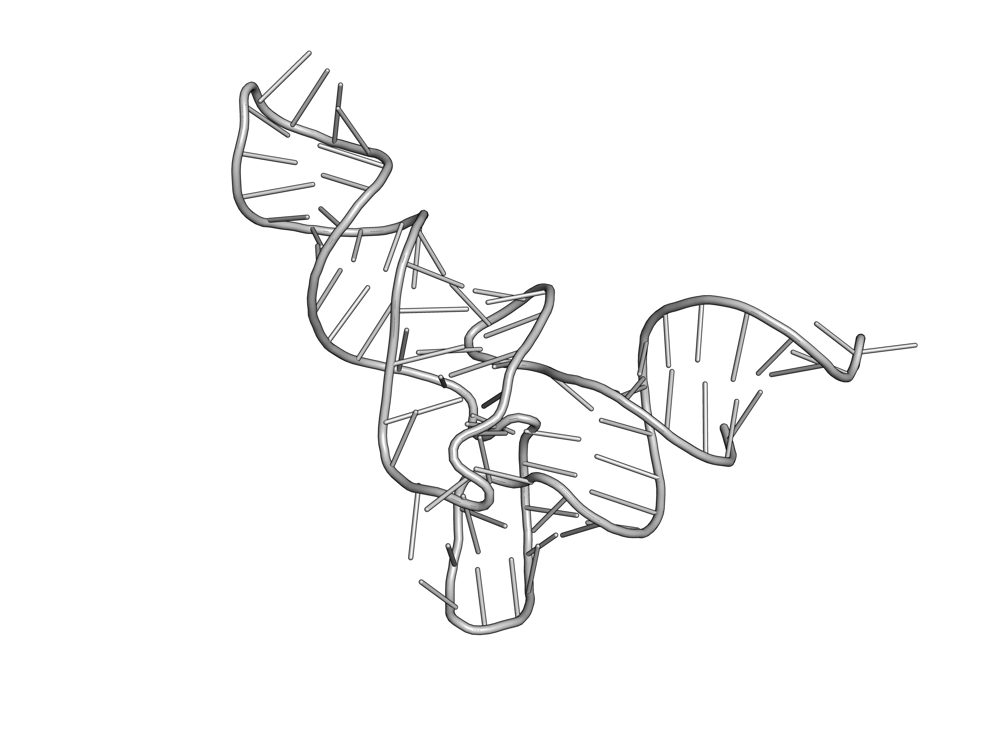
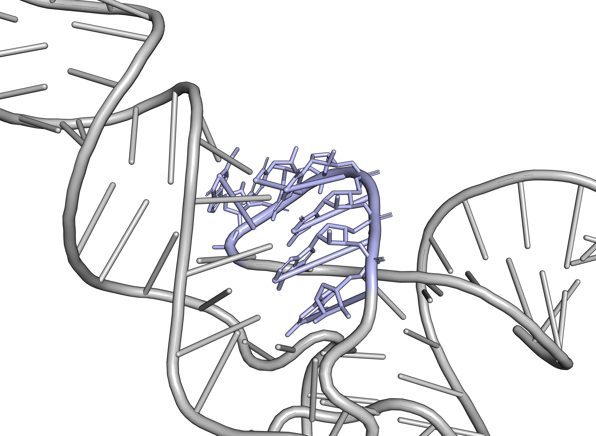
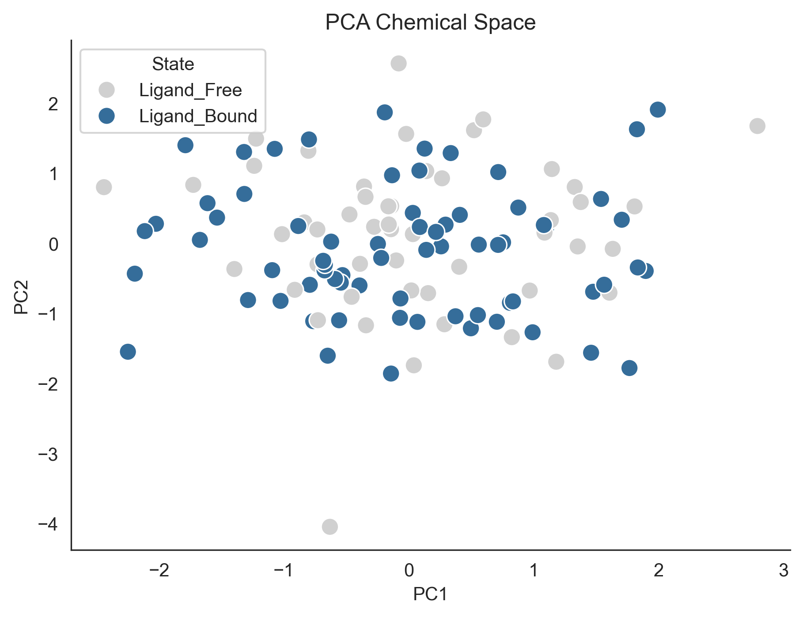

# RNA virtual screening analysis
This repository presents educational and exploratory workflows related to RNA-targeted virtual screening and computational drug discovery. The purpose of this repo is to showcase a workflow similar to the one I used in my Master's thesis work "Evaluating the Influence of Conformational and Chemical-Space Diversity on RNA Virtual Screening".

## Overview
The project focuses on computational approaches used to explore RNA-ligand interactions, chemical space diversity and structural analysis in virtual screening workflows. The repository includes simplified examples inspired by cheminformatics and computational chemistry methodologies developed during academic research activities.

## Topics explored
- RNA-targeted virtual screening
- Molecular docking concepts
- Chemical space analysis
- PCA visualization
- Structural interpretation
- Computational drug discovery workflows

## Example visualizations

### RNA structural overview

### Local structural inspection

### PCA chemical space

## Tools/libraries
- Python
- RDKit
- pandas
- seaborn
- PyMOL

## Disclaimer
The repository contains educational and non-confidential material intended for portfolio and learning purposes.
